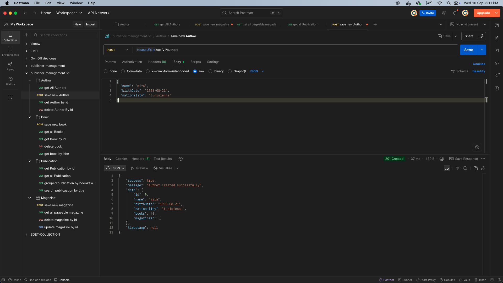
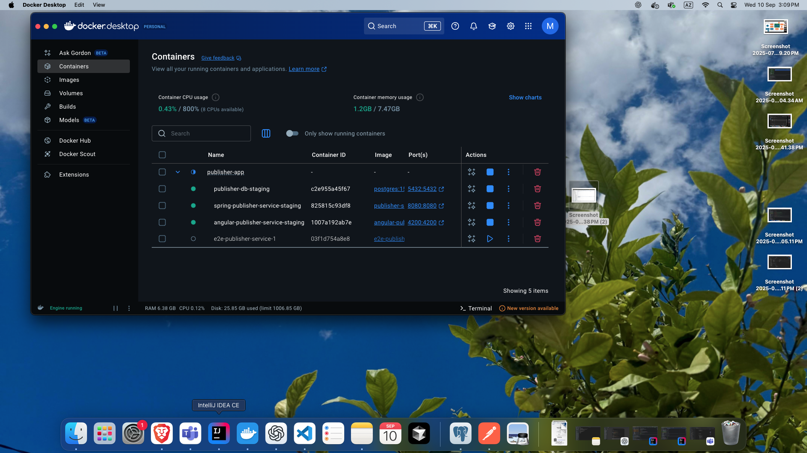

# Spring Publisher Service

## Description
A comprehensive system to manage publishers, books, magazines, and authors using a RESTful API architecture.
The objective is to create a RESTful API to manage a publisher's publications (books and magazines) as well as authors.
This service is part of a larger microservices architecture that includes an Angular frontend and E2E testing with Playwright.

---

## Table of Contents

- [Technologies & Dependencies](#technologies--dependencies)
- [Architecture Overview](#architecture-overview)
- [Prerequisites](#prerequisites)
- [Getting Started](#getting-started)
- [Docker Setup](#docker-setup)
- [Running the Application](#running-the-application)
- [Testing](#testing)
- [Project Structure](#project-structure)
- [API Features](#api-features)
- [Configuration](#configuration)
- [Monitoring & Logging](#monitoring--logging)gement System


## Technologies & Dependencies

### Core Framework
- **Spring Boot 3.5.3** - Main application framework
- **Java 17** - Programming language
- **Maven** - Build and dependency management

### Database & Data Access
- **Spring Data JPA** - Data persistence layer
- **PostgreSQL** - Database system
- **Hibernate** - ORM implementation (via Spring Data JPA)

### Web & API
- **Spring Web** - REST API development
- **SpringDoc OpenAPI 3.2.8** - API documentation and Swagger UI
- **Spring REST Docs** - API documentation generation

### Development Tools
- **Spring Boot DevTools** - Development productivity tools
- **Lombok** - Boilerplate code reduction
- **MapStruct 1.6.3** - Bean mapping framework

### Testing Framework
- **JUnit 5 (5.10.0)** - Unit testing framework
- **Mockito 5.5.0** - Mocking framework
- **AssertJ** - Fluent assertions library
- **Spring Boot Test** - Integration testing support

### Code Quality & Coverage
- **JaCoCo 0.8.13** - Code coverage analysis
- **Maven Surefire Plugin** - Unit test execution
- **AsciiDoc Maven Plugin** - Documentation generation

---

## Monitoring & Logging

### Monitoring
The application uses Spring Boot Actuator for monitoring and metrics:

- Health checks: `/actuator/health`
- Metrics: `/actuator/metrics`
- Info: `/actuator/info`
- Environment: `/actuator/env`

Monitoring is automatically enabled for staging and production environments.

### Logging
- Uses SLF4J with Logback
- Log files are rotated daily
- Different log levels for different environments:
  - DEV: DEBUG
  - STAGING: INFO
  - PROD: WARN
- Logs are stored in `logs/` directory

## Configuration

### Environment Variables
Key configuration parameters that can be set:

```properties
# Server
APP_PORT=8080
SPRING_PROFILES_ACTIVE=dev

# Database
POSTGRES_HOST=localhost
POSTGRES_PORT=5432
POSTGRES_DB=publisher
POSTGRES_USER=postgres
POSTGRES_PASSWORD=secret

# JWT Security
JWT_SECRET=your-secret-key
JWT_EXPIRATION=86400000

# Monitoring
MANAGEMENT_ENDPOINTS_WEB_EXPOSURE_INCLUDE=health,metrics,info
```

### Profile-Specific Configuration
Each environment (dev/staging/prod) has its own configuration file in the `config/` directory:
- `.env.dev` - Development settings
- `.env.staging` - Staging settings
- `.env.prod` - Production settings

---

## Prerequisites

Before running this application, ensure you have the following installed on your machine:

- **Docker** - Required for running the database and application containers
- **Maven 3.6+** - Required for building and running tests
- **Java 17** - Required for compilation and execution

---

## Getting Started

## Architecture Overview

The Spring Publisher Service follows a layered architecture pattern:

```
├── API Layer (Controllers)
├── Service Layer (Business Logic)
├── Repository Layer (Data Access)
└── Database Layer (PostgreSQL)
```

Key architectural components:
- **REST Controllers**: Handle HTTP requests and responses
- **Services**: Implement business logic and transaction management
- **Repositories**: Interface with the database using Spring Data JPA
- **DTOs**: Data transfer objects for API requests/responses
- **Entities**: JPA entities representing database tables
- **Mappers**: MapStruct-based object mapping between DTOs and entities

## Docker Setup

The application is containerized using Docker. The `Dockerfile` provides a multi-stage build:

1. **Build Stage**:
   - Uses Maven 3.9.6 with Eclipse Temurin JDK 17
   - Builds the application JAR
   - Supports different Maven profiles for environments

2. **Runtime Stage**:
   - Uses Eclipse Temurin JRE 17
   - Runs as non-root user for security
   - Configurable through environment variables

### Docker Commands

```bash
# Build the Docker image
docker build -t spring-publisher --build-arg ENV=dev .

# Run the container
docker run -p 8080:8080 \
  -e SPRING_PROFILES_ACTIVE=dev \
  -e POSTGRES_HOST=host.docker.internal \
  spring-publisher
```

## Running the Application

The application can be run using the provided `run-spring.sh` script:

```bash
# Start in development mode
./scripts/run-spring.sh dev start

# Start in staging mode
./scripts/run-spring.sh staging start

# Start in production mode
./scripts/run-spring.sh prod start

# Stop the application
./scripts/run-spring.sh <env> stop
```

The script provides:
- Environment-specific configuration loading
- Database connection setup
- Automatic monitoring profile activation for staging/prod
- Graceful shutdown handling

### Configuration Files

Environment configurations are stored in:
- `config/.env.dev` - Development environment
- `config/.env.staging` - Staging environment
- `config/.env.prod` - Production environment

## Execution Screenshots

### Application postman 

*Screenshot showing the Spring Boot application colletion*

### Spring Docker

*Screenshot showing the Spring Boot dockeization*

### Access Points

Once started, you can access:

- **API Base URL:** [http://localhost:8080](http://localhost:8080)
- **Swagger UI:** [http://localhost:8080/swagger-ui.html](http://localhost:8080/swagger-ui.html)
- **OpenAPI Docs:** [http://localhost:8080/v3/api-docs](http://localhost:8080/v3/api-docs)
- **Actuator Endpoints:** [http://localhost:8080/actuator](http://localhost:8080/actuator) (staging/prod only)

---

## Testing

### Running Unit Tests

Execute unit tests with Maven:

```bash
mvn clean test -Dtest="*Test"
```

### Viewing Test Results

After running tests, you can view the test coverage report generated by JaCoCo:

```bash
open target/site/jacoco/index.html
```


---

## API Features

The API provides endpoints for managing:

- **Publishers** – Create, read, update, and delete publisher records
- **Books** – Manage book publications including associations with authors
- **Magazines** – Manage magazine publications including contributors
- **Authors** – Manage author information and relationships to books/magazines

---
## Postman collection link 

https://crimson-firefly-435227.postman.co/workspace/My-Workspace~60f74345-bb67-44de-89ff-b1ef0e3660c8/collection/29612292-a9bb2795-2ef8-4fba-bb7c-8f17436837a7?action=share&source=copy-link&creator=29612292
 
